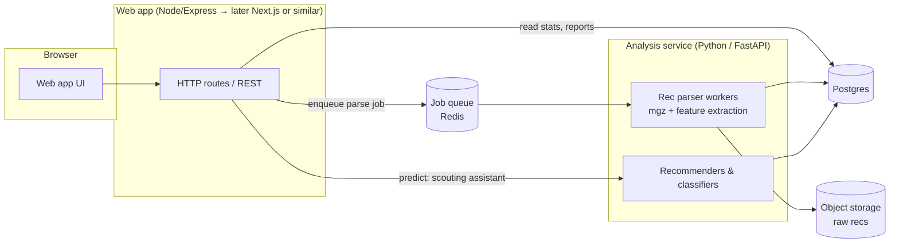

# AoE2:DE Assistant — Project Plan

A coaching assistant that helps new Age of Empires II: Definitive Edition players improve, powered
by analysis of thousands of publicly available recorded games. Web-first, with an optional desktop
companion later.

**Target user:** new and low/mid-Elo ranked players (< ~1200 Elo, 1v1 and team ranked) who don't yet
know what "good" looks like for their civ, map, and rank.

---

## 1. Product pillars

| # | Pillar | What the player gets |
|---|--------|----------------------|
| P1 | **Build order & action recommendations** | "For *your* civ, game mode, map, and Elo band, here are the openings that actually win, with step-by-step orders and timings." |
| P2 | **Unit counter recommendations** | "You're facing Knights + Skirmishers — produce Pikemen and Archers; avoid Camels here because…" |
| P3 | **Strategy deduction (scouting assistant)** | "You scouted a Stable and 2 houses walling at 8:30 vs. Franks — expect Scouts into Knights; wall food, add Spears." |
| P4 | **Recorded game review** | Upload a `.aoe2record` file → a coach-style report: what you did well, top 3 things to fix, benchmarked against winners at your Elo. |

P4 (replay review) is the flagship differentiator and the flywheel: it delivers personalized value,
and every uploaded rec grows the corpus that improves P1 and P3.

---

## 2. Where ML actually helps (and where it doesn't)

Being honest about this up front saves months:

- **P2 Counters — no ML needed.** Unit matchups are deterministic: attack bonuses vs. armor
  classes, cost efficiency, and civ tech availability all come from the game's data files. A rule
  engine over extracted game data (e.g. the [aoe2techtree data](https://github.com/SiegeEngineers/aoe2techtree)
  JSON or [halfon](https://github.com/SiegeEngineers/halfon)) gives *correct* answers; a model would
  only approximate them. ML can later re-rank counters by what actually wins at low Elo (e.g.
  "on paper Camels counter Knights, but at 800 Elo players micro them badly").
- **P1 Build orders — statistics & sequence mining first, deep learning later.** Mining frequent
  opening sequences from parsed recs, clustered by similarity and conditioned on (civ, map, Elo
  band, patch), with observed win rates, is a strong recommender. A next-action sequence model
  (transformer over action streams) is a Phase-2 upgrade, not a prerequisite.
- **P3 Strategy deduction — a real ML problem.** Given partial observations ("what you could have
  scouted by time t"), predict the opponent's opening. Training data is free: recs give full
  information, so labels (the strategy actually played) can be generated by rule-based labeling of
  complete build orders, and the model learns from the *observable subset*.
- **P4 Replay review — benchmarking + rules first, ML for prioritization.** Most actionable
  feedback for new players is measurable directly: Town Center idle time, villager count by minute,
  age-up times, time spent housed, late walls, no scouting. The "ML" is learning Elo-conditioned
  benchmark distributions from the corpus and ranking which deviations most correlate with losing
  at the player's rank. An optional LLM layer can turn the structured findings into readable,
  coach-like prose.

---

## 3. Data strategy

### 3.1 Sources

| Source | What it gives | Notes |
|--------|---------------|-------|
| [aoestats.io data dumps](https://aoestats.io/api-info/) | Weekly `matches.parquet` + `players.parquet` for ranked matches (civ, map, Elo, result, game version) | Free, documented, automated weekly. Backbone for win-rate stats (P1 priors, P2 re-ranking, P4 benchmarks). No replay files. |
| Official AoE Stats page / match APIs | Per-match replay downloads for recent ranked games | Replays **expire** and only replay correctly on the current patch — corpus building must be a *continuous* pipeline, not a one-time scrape. Terms of use must be reviewed; throttle politely. |
| User uploads | `.aoe2record` files from the player's own `saves/` folder | No expiry problem; grows with usage. Get consent to add uploads (anonymized) to the training corpus. |
| [SiegeEngineers game data](https://github.com/SiegeEngineers/aoe2techtree) | Unit stats, armor classes, attack bonuses, tech trees, per-civ availability | Powers the deterministic counter engine and tech-tree awareness. Updated per patch by the community. |
| Kaggle mirrors ([1](https://www.kaggle.com/datasets/jerkeeler/age-of-empires-ii-de-match-data), [2](https://www.kaggle.com/datasets/tonypolik/aoestats-matches)) | Historical snapshots of aoestats data | Useful for early prototyping before our own pipeline exists. |

> ⚠️ **Lesson from history:** aoe2.net (once *the* community API) shut down abruptly. Never depend
> on a single third-party source; keep raw downloads archived in our own object storage.

### 3.2 Parsing recorded games

- `.aoe2record` files store **player commands (inputs), not game state**. Build orders, age-up
  times, and army composition are derived from `Train`/`Build`/`Research` commands with timestamps;
  resource counts and idle time must be **reconstructed or approximated** (e.g. TC idle time from
  gaps between villager-creation commands while population room exists).
- Parser: [`mgz` (aoc-mgz)](https://github.com/happyleavesaoc/aoc-mgz) — Python, actively
  maintained (updates through 2025), `fast` and `full` modes. Higher-level extraction exists in
  [AgeAlyser](https://github.com/byrnesy924/AgeAlyser_2) (worth evaluating before writing our own
  feature extractors).
- **Every parsed match must be tagged with its game version.** Balance patches shift civ/unit
  strength and invalidate old meta; stats and models are computed per patch (with weighted
  carry-over from prior patches when a new patch has thin data).

### 3.3 Storage & pipeline

```
[aoestats parquet] ─┐
[replay downloader] ─┼→ raw archive (S3-compatible object storage)
[user uploads]      ─┘        │
                              ▼
                    parse workers (Python + mgz)
                              │
                              ▼
        Postgres: matches, players, parsed events, derived features
                              │
                              ▼
     offline jobs (Polars/DuckDB): stats tables, mined build orders,
     Elo-band benchmarks, trained models (versioned artifacts)
```

Scale check: "thousands of games" of parquet metadata is trivially small; even 100k replay files at
~2–5 MB each is ~500 GB max in cheap object storage, and parsing is embarrassingly parallel.

---

## 4. System architecture

Web-first (confirmed). Two services, one database:



**Why a separate Python service:** the entire parsing/ML ecosystem (`mgz`, Polars, scikit-learn,
PyTorch) is Python; the web layer stays thin. This split also lets the heavy parse workers scale
independently of the website.

**Existing skeleton:** the repo is a 2020-era Express + EJS + node-sass scaffold with a
hand-written civ/strategy schema sketch (`bin/db-schema.hjson`) and a three.js experiment for 3D
map previews.

- Keep Express as the web layer for Phase 1 — it's fine for server-rendered pages.
- **Replace hand-authored game knowledge** (`db-schema.hjson`) with data generated from
  SiegeEngineers game data — hand-maintaining 45+ civs × units × patches does not scale and
  invalidates itself every balance patch. Curated *prose* (strategy explanations, tips) stays
  human-written, but keyed to generated entities.
- Modernize the toolchain early (it's cheap now, painful later): Express 4.16 → current, drop
  deprecated `node-sass-middleware`, add ESLint/Prettier, CI, and TypeScript if desired. Plan a
  frontend framework (React/Next.js, or keep EJS + htmx for simplicity) when interactive features
  (P3 assistant, report visualizations) arrive in Phase 3–4.
- The three.js map viewer is a charming nice-to-have; park it until the core loop works.

**Deployment:** Docker Compose on a single VPS to start (web + api + worker + Postgres + Redis +
MinIO). Nothing here needs Kubernetes until it hurts.

---

## 5. Feature design details

### P1 — Build order & action recommendations
1. **v0 (stats-driven):** from aoestats dumps — civ × map × Elo-band win rates, popular strategies.
   Pair with curated build orders (hand-picked, community-standard: Scouts, Men-at-Arms, Archers,
   Fast Castle, etc.) tagged by civ suitability.
2. **v1 (mined from recs):** extract opening action sequences from the rec corpus; cluster with
   edit-distance/sequence similarity into named openings; per (civ, map, Elo band, patch) surface
   the top openings **by win rate at that Elo** with real median timings ("Feudal at 10:40 is
   normal at 900 Elo — don't panic chasing the pros' 8:20").
3. **v2 (interactive):** step-by-step build order player (timer, checkpoints), and "you deviated
   here" cross-links from the P4 replay reports.

### P2 — Counter engine
- Deterministic engine over generated game data: for any enemy composition, rank counter units by
  bonus damage, armor class matchups, cost efficiency, and *availability to the player's civ and
  current age*. Explain the "why" (this is a teaching tool, not just an answer).
- Reverse view for P3: "which units/buildings should scare you" per enemy civ.
- Later: re-rank by empirical win-rate impact at the player's Elo band.

### P3 — Strategy deduction assistant
- Web UI: player selects matchup context (their civ, enemy civ, map, Elo), then taps observations
  as they scout ("enemy has 2nd Lumber Camp", "Stable in base", "walled front by 9:00").
  Output: live-updating probability distribution over openings + what to prepare.
- Model: gradient-boosted trees or a small neural net over engineered observation features;
  training pairs generated from the rec corpus (observable-by-time-t features → rule-labeled
  actual opening). Start with the *prior* only (civ/map/Elo → strategy frequencies), which is
  useful by itself and is just counting.
- This is a *between-actions* aid (AoE2 has pauses, and new players can use it post-scouting or in
  casual games). **No memory reading, no live game hooks** — see Risks.

### P4 — Replay review
- Upload → parse → report pipeline (async job, email/notify when ready, typically < 1 min).
- Report contents, benchmarked against Elo-matched winners on the same patch:
  - Economy: villager production consistency, TC idle estimate, time housed, idle military
    production during "quiet" phases.
  - Timings: age-up times vs. band medians; reaction time to aggression.
  - Strategy: opening classification (yours and opponent's), counter appropriateness of unit
    choices, walls/scouting behavior.
  - **Top 3 improvements**, ranked by estimated win-rate impact at the player's Elo — new players
    need focus, not 40 data points.
- Optional LLM narration layer converts the structured findings into friendly coach prose.
  Structured findings must stand alone (LLM is presentation, not analysis).

---

## 6. Roadmap

| Phase | Deliverable | Depends on | Rough effort |
|-------|-------------|------------|--------------|
| **0. Foundations** | Repo restructure (`web/` + `services/analysis/`), dependency modernization, CI, Docker Compose dev env | — | 1–2 weeks |
| **1. Knowledge core** | Counter explorer (P2 v0) + civ/map/Elo stats pages from aoestats dumps (P1 v0) + curated build order library | Game data ETL, aoestats ingestion | 3–5 weeks |
| **2. Replay review MVP** | Upload a rec → parsed report with economy/timing benchmarks (P4 v0); user accounts | Python service, mgz pipeline, Postgres schema | 4–8 weeks |
| **3. Corpus & mining** | Continuous replay downloader + archive; mined build orders with win rates (P1 v1); benchmark distributions harden | Phase 2 pipeline | 4–6 weeks |
| **4. Strategy assistant & coaching** | P3 assistant (prior-based, then trained model); multi-game trend reports ("your TC idle is improving"); LLM report narration | Corpus from Phase 3 | 6–10 weeks |
| **5. Desktop companion (optional)** | Tauri/Electron tray app that watches the `saves/` folder and auto-uploads new recs for review | Stable P4 | 2–4 weeks |

Each phase ships something a real player can use. Phase 1 requires no replay parsing at all, so the
site becomes useful fast while the harder pipeline work proceeds.

**Success metrics:** weekly active reviewers (P4 uploads/week), report → return rate, build order
page engagement, and eventually measured Elo gain of returning users vs. matched non-users.

---

## 7. Prior art & differentiation

Worth studying (and not rebuilding): [aoe2insights.com](https://www.aoe2insights.com) (match
analysis, build order extraction), [aoecompanion.com](https://aoecompanion.com) /
aoe2companion (stats, overlay), [buildorderguide.com](https://buildorderguide.com) (curated build
orders), Capture Age (pro-grade spectating/analysis), aoestats.io (meta stats).

**Our niche:** none of these *coach*. They present data; they don't tell an 850-Elo Franks player
the three things to fix, benchmarked against players who actually win at 850 Elo, or teach counters
with explanations. Rank-conditioned, prescriptive, beginner-first guidance is the identity of this
project — every feature should answer "so what should I do?"

---

## 8. Risks & mitigations

| Risk | Impact | Mitigation |
|------|--------|-----------|
| Replay source dries up or changes terms (aoe2.net precedent) | Corpus growth stalls | Archive everything we fetch; multiple sources; user uploads as an independent channel |
| Patch churn breaks parsing or invalidates meta | Wrong recommendations | Version-tag all data; per-patch stats; parser test suite with fixture recs from each patch; pin `mgz` and update deliberately |
| Rec files lack true game state (commands only) | Metric accuracy limits | Prefer robust command-derived metrics; label approximations honestly in reports; validate heuristics against hand-analyzed games |
| Anti-cheat / EULA concerns for anything real-time | Account bans, takedowns | Web + post-game analysis only; desktop app only watches the filesystem; never read game memory or inject overlays into the game |
| Low-Elo data is noisy ("winning" builds may win for unrelated reasons) | Misleading recommendations | Large samples per bucket; blend with curated expert builds; show confidence/sample sizes |
| Scope creep (this plan is 4 products) | Nothing ships | Phase gates above; Phase 1–2 only until real users exist |
| Hosting/compute cost | Burn without users | Single VPS + cheap object storage; parsing is on-demand + batch, no GPU needed until sequence models |

---

## 9. Open decisions

1. **Web stack evolution** — stay Express/EJS (+ htmx) for simplicity, or adopt React/Next.js
   before Phase 3's interactive UIs. (Recommendation: decide at end of Phase 1; don't rewrite now.)
2. **TypeScript** for the web layer — cheap to adopt during Phase 0, harder later.
3. **Account system** — roll our own vs. OAuth (Steam/Xbox login would let us auto-find a player's
   ranked matches and Elo — high value for P4; feasibility of Xbox Live/Relic ID lookup needs a
   spike).
4. **Corpus consent & privacy** — uploaded recs contain player names; define anonymization policy
   before Phase 3 mining.
5. **Team games** — plan above assumes 1v1 ranked first (cleaner data, clearer coaching); when do
   team modes enter?

---

## 10. Immediate next steps

1. Phase 0: restructure repo, modernize deps, add CI and Docker Compose.
2. Spike A (1–2 days): pull one aoestats weekly dump, load into Polars/DuckDB, reproduce a
   civ × map × Elo-band win-rate table.
3. Spike B (2–3 days): parse 20 recs of varying patches with `mgz` (and evaluate AgeAlyser);
   confirm we can extract build orders, age-up times, and a TC-idle estimate.
4. Spike C (1 day): extract unit stats + attack bonuses from aoe2techtree data and hand-verify 5
   known counter relationships (e.g. Spearman → Knight bonus damage).
5. Write the Postgres schema for matches/players/events informed by Spikes A–B.
